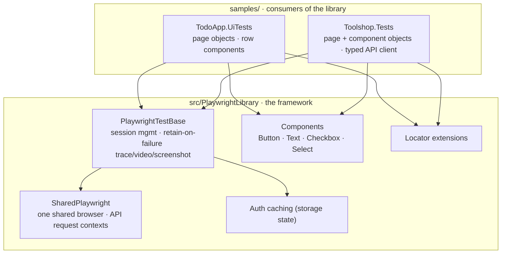
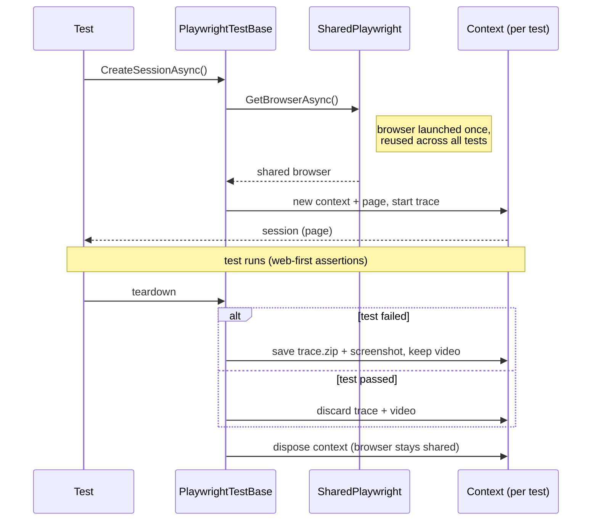

# CSharp-Playwright-Library

[](https://github.com/JamesHulsey/CSharp-Playwright-Library/actions/workflows/ci.yml)

A reusable Playwright + NUnit test framework for C#, with two sample apps that consume it.

**Highlights**

- Reusable Playwright + NUnit framework on .NET 10
- One shared browser, an isolated context per test — parallel-safe by design
- Storage-state authentication with caching
- **API, UI, and hybrid** (API ↔ UI) testing, shown across **two** sample apps
- Retain-on-failure **trace / video / screenshot**, attached to test results
- GitHub Actions CI with a deliberately scoped, reliable gate

## Why this exists

The goal isn't to wrap Playwright — it's to provide opinionated infrastructure around
the parts every UI-automation suite re-implements: browser and session lifecycle,
authentication, reusable components, media capture, and parallel execution. Consumers
stay lightweight and focus on tests, not framework plumbing. The two `samples/`
projects prove the point by driving the same library against two different apps.

## Architecture

The library is the framework core; each sample is a standalone consumer that reaches
it only through its public API. A consumer's tests drive page objects, which compose
component objects, which wrap the library's components.



Every test gets a fresh, isolated browser **context** but shares one **browser**, and
media/traces are captured yet retained only on failure:



## Quick start

```bash
dotnet test
```

That's it. Each test project's `PlaywrightBrowserSetup` fixture downloads Chromium on
the first run — no manual `playwright install` step — and the download is cached per user.

> On Linux the browser also needs OS-level libraries; CI installs them with
> `playwright.ps1 install --with-deps`, and you can run the same once locally if a
> browser fails to start.

## Writing a test

```csharp
public class MyTest() : PlaywrightTestBase("https://my-app.example.com", Options)
{
    private static TestOptions Options => new()
    {
        Environment = "qa",
        Browser = "chromium",
        Headless = true,
        Video = TestVideoOptions.Default
    };

    [Test]
    public async Task DoesSomething()
    {
        var session = await CreateSessionAsync();          // anonymous
        // var session = await CreateSessionAsync(authOptions);  // authenticated

        var save = new ButtonComponent(session.Page.GetByRole(AriaRole.Button, new() { Name = "Save" }));
        await save.ClickAsync();
    }
}
```

Multi-user tests: call `CreateSessionAsync` more than once. Every session is tracked and disposed in teardown.

## Authentication

```csharp
private static PlaywrightAuthOptions AdminAuth => new()
{
    AuthFilePath = "auth-state.admin.json",
    LoginAction = async page =>
    {
        await page.GetByLabel("Username").FillAsync("...");
        await page.GetByLabel("Password").FillAsync("...");
        await page.GetByRole(AriaRole.Button, new() { Name = "Sign in" }).ClickAsync();
        return await page.GetByTestId("home").IsVisibleAsync();
    }
};
```

The first call opens a headed browser, runs `LoginAction`, and caches storage state to `AuthFilePath`.
Subsequent tests reuse the cache until `CacheLifetime` (default 12h) elapses. Locking is per file
path, so multiple roles can be minted concurrently.

## Media & traces

- **Video** records for every session when `TestOptions.Video` is set.
- A **Playwright trace** records for every session when `TestOptions.Trace` is set
  (retain-on-failure style — the richest debugging artifact Playwright offers).
- On pass: video and trace are discarded and empty directories pruned.
- On fail: the video, a full-page **screenshot**, and the **trace zip** are kept
  together and attached to the NUnit test result, so they surface in test reports
  and CI. Open a trace with `playwright show-trace trace.zip`.
- Output path: `{Directory}/{yyyy-MM-dd}/{Environment}/{TestName}/{HH.mm.ss}/`

Set `Video`/`Trace` to `null` to disable either.

## Parallelism

`PlaywrightTestBase` is `[Parallelizable(ParallelScope.All)]` with
`[FixtureLifeCycle(LifeCycle.InstancePerTestCase)]` — a fresh fixture instance per test, each with
its own browser context, so instance fields are safe without locking. The browser itself is shared
across tests (see [Design decisions](#design-decisions)). Worker count is set in `.runsettings`.

## Design decisions

The trade-offs worth knowing, and why they were made:

- **One shared browser, a context per test.** Launching a browser is expensive;
  contexts are cheap and fully isolated. `SharedPlaywright` owns the single
  Playwright driver and reuses one browser per launch-config, while each test gets
  its own context. Browsers are disposed on process exit, because a library has no
  assembly-level teardown hook inside the consumer.
- **Browsers and API contexts are independent siblings.** Mirroring Playwright's own
  shape (`IPlaywright` exposes both browsers and `APIRequest`), `SharedPlaywright`
  hands out browsers and API request contexts from the same driver but with no
  dependency between them — an API-only test never launches a browser.
- **Config is the consumer's job, not the library's.** `PlaywrightTestBase` takes
  `TestOptions` rather than inventing them, and `Browser`/`Environment` are
  `required` to force a conscious choice. The library is the mechanism; the consumer
  owns policy — the samples source theirs from `.runsettings`.
- **Run settings over environment variables.** Config comes from `<TestRunParameters>`
  — a file people edit — rather than machine environment variables. Cleaner precedence,
  and `.runsettings` stays reserved for runner concerns while app config rides in one
  committed file.
- **Project reference over a NuGet package.** The samples consume the library by
  project reference to keep the repo clone-and-run simple; production would publish
  a versioned package. Left deliberate rather than hidden.
- **No `networkidle` wait.** Playwright discourages it; readiness is asserted with
  web-first assertions instead, which are less flaky.
- **Retain-on-failure artifacts.** Video, trace, and screenshot are captured but
  only kept — and attached to the test result — when a test fails, so green runs
  stay clean.

## Scope

The component model is deliberately small — `ButtonComponent`, `TextInput`,
`CheckboxInput`, `SelectComponent` — thin wrappers that give a locator an
intent-revealing API. Anything more specialized (tables, date pickers, auto-complete)
belongs to the consuming project, which knows its own DOM. The library assumes only
standard ARIA roles and test IDs, so it drops into any Playwright + NUnit project.

## Continuous integration

`.github/workflows/ci.yml` runs the sample suites on every merge to `main`, on a
GitHub-hosted Ubuntu runner: it builds the sample projects (which pull in the library),
installs Chromium with `--with-deps`, and runs the tests.

One deliberate carve-out: the **Toolshop UI tests** (NUnit category `ExternalUi`) are
**excluded from CI**. The Toolshop app sits behind Cloudflare bot-protection, which
blocks headless browsers on CI data-center IPs, so the page never renders there — those
tests are stable locally and run there instead. CI covers the **TodoApp UI suite** and
the **Toolshop API tests**. Keeping a flaky external-site dependency out of the merge
gate is deliberate: a scoped, trustworthy green beats an intermittent red.

## Project layout

```
CSharp-Playwright-Library.slnx
src/PlaywrightLibrary/
  Testing/     PlaywrightTestBase, PlaywrightSession, SharedPlaywright, TestOptions,
               TestVideoOptions, TestTraceOptions, PlaywrightAuthOptions/Helper, TestMediaHelper
  Components/  IComponent, ButtonComponent, TextInput, CheckboxInput, SelectComponent
  Extensions/  LocatorExtensions
tests/PlaywrightLibrary.SmokeTests/   minimal "harness boots" check
samples/TodoApp.UiTests/              UI sample (page objects, row components)
samples/Toolshop.Tests/               API + UI + hybrid sample
```

## The samples

### `samples/TodoApp.UiTests`

A standalone consumer via project reference, laid out like a real UI suite:

- **`TestConfig`** reads run settings (URL, browser, headless, slowMo, environment)
  from the `.runsettings` `<TestRunParameters>`, each with a code default — edit the
  file to change how the suite runs, no code change or machine env vars.
- **`TodoAppTestBase`** binds the library base to `TestConfig` and exposes `OpenTodoAppAsync()`.
- **`TodoPage`** owns page-level actions and hands out **`TodoRow`** component objects
  (`Row(todo)` / `GetRowsAsync()`).
- **`TodoRow`** wraps one row and resolves its title/checkbox relative to that root
  (`CompleteAsync`, `IsCompletedAsync`, `IsStruckThroughAsync`), composing `CheckboxInput`.
- **`TodoItem`** — a record passed around as test data instead of bare strings.

> **Dependency style:** a project reference keeps the repo clone-and-run simple; in
> production you'd publish a versioned NuGet package and `dotnet add package`. Left
> deliberate rather than hidden.

### `samples/Toolshop.Tests`

A **second** consumer (targeting `practicesoftwaretesting.com`), proving reusability
across apps and showcasing **API, UI, and hybrid** testing:

- **API-only** tests via `ToolshopApiClient` — the API's page-object equivalent: typed
  models (`Product`, `Category`) over the library's API request context, no browser.
- **UI** tests via page objects (`ProductCatalogPage`, `ProductDetailPage`, `LoginPage`,
  `CartPage`, `CheckoutPage`) and component objects (`SiteHeader`, `ProductCard`);
  `ToolshopUiTestBase` opens the landing page before each test.
- A **login flow** (happy path and a negative case) plus **storage-state auth caching**
  — log in once, cache, and start later sessions signed in.
- An **end-to-end checkout** — sign in, add to cart, and walk the address/payment stepper
  to a placed order.
- A **hybrid** test that reads the source of truth from the API and asserts the UI matches.
